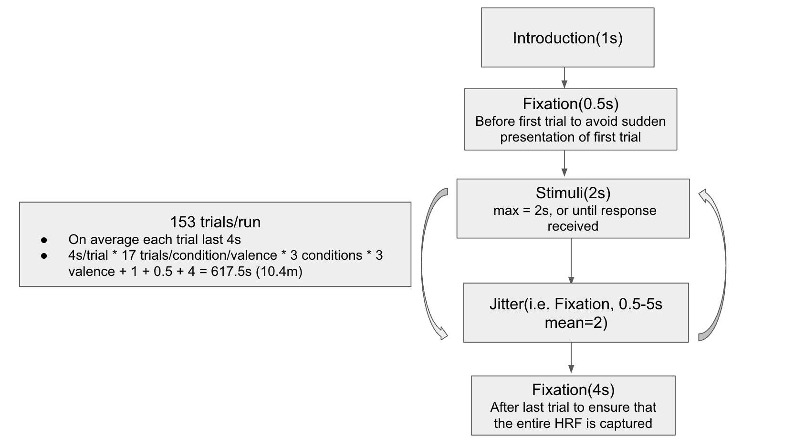

# Self_Other

* Work on psychopy v2024.1.5 on Mac OS 
* Mark reported error for windows as follows for last version, please notice that could still true for current version. Test it and add codes for different operating system if needed.
 

* Experiment design
 

* The experiment sequences were generate using [Neurodesign](https://github.com/neuropower/neurodesign.git), the criteria for both sequences are:
 
  
|       | Fe      | Fd     | Ff      | Fc      |
|---------------|---------------|---------------|---------------|---------------|
| sequence_run1  | 6.20  | 3.60  | 1  | 0.92  |
| sequence_run2  | 6.58  | 3.57  | 1  | 0.92  |

Fe: estimation efficiency (when you want to investigate the entire shape of the HRF)
Fd: detection efficiency (when you are only interested in amplitude changes/differences)
Ff: how close the frequency of each condition is to the desired probability（[1/3,1/3,1/3] for current experiment）
Fc: how well the conditions are “counterbalanced” in time
